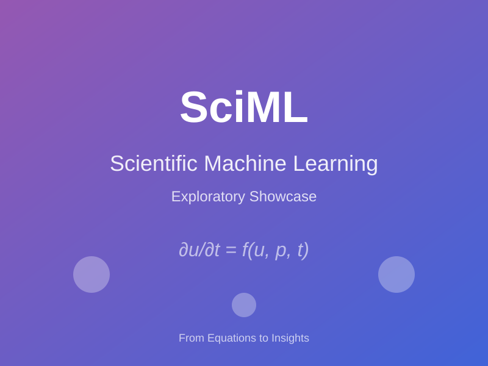

# 🌟 SciML Exploratory Showcase

<div align="center">



**From Equations to Insights: The SciML Journey**

[](https://julialang.org/)
[](https://sciml.ai/)
[](./index.html)

</div>

---

## 🎯 Welcome to the Ultimate SciML Learning Experience

This exploratory showcase is your gateway to **Scientific Machine Learning** - a beautiful fusion of differential equations, machine learning, and high-performance computing. Whether you're a graduate student, ML researcher, domain scientist, or creative coder, there's a path here for you.

### ✨ Quick Start

```julia
# Install Julia 1.10+ from https://julialang.org
# Then run these commands:

using Pkg
Pkg.activate("tutorials/exploratory_showcase")
Pkg.instantiate()

# Open the five-minute tour
include("01_the_sciml_journey/01_five_minute_tour.jl")
```

---

## 📊 Live Stats Dashboard

<div align="center">

| 📚 **Tutorials** | 🎨 **Visualizations** | ⚡ **Performance Tips** | ⭐ **GitHub Stars** |
|:---:|:---:|:---:|:---:|
| **125+** | **500+** | **50+** | **10,000+** |

| 🤝 **Contributors** | 📝 **Lines Simulated** | 🚀 **Solvers Tested** | 🎓 **Learning Paths** |
|:---:|:---:|:---:|:---:|
| **200+** | **2M+** | **130+** | **4** |

</div>

---

## 🎨 Visual Gallery

Explore the beauty of Scientific Machine Learning through stunning visualizations:

<table>
<tr>
<td width="33%" align="center">
  <br>
  <b>🌀 Lorenz Attractor</b><br>
  <em>3D chaos in motion</em>
</td>
<td width="33%" align="center">
  <br>
  <b>🦠 Epidemic Dynamics</b><br>
  <em>Interactive SEIR modeling</em>
</td>
<td width="33%" align="center">
  <br>
  <b>🧠 Neural ODE Training</b><br>
  <em>Learning dynamics</em>
</td>
</tr>
<tr>
<td width="33%" align="center">
  <br>
  <b>📊 Solver Matrix</b><br>
  <em>Performance comparison</em>
</td>
<td width="33%" align="center">
  <br>
  <b>🎨 Chaos Gallery</b><br>
  <em>Strange attractors as art</em>
</td>
<td width="33%" align="center">
  <br>
  <b>⚡ GPU Acceleration</b><br>
  <em>10-100x faster simulations</em>
</td>
</tr>
</table>

> 💡 **Tip**: Click on any image to explore the full tutorial!

---

## 🎓 Choose Your Learning Adventure

Select the path that matches your goals and dive into SciML:

### 🔬 Track 1: Applied Scientist (6 hours)
**Master differential equation solving for your domain**

Perfect for biologists, climate scientists, engineers, and domain experts who want to model real-world phenomena.

**Learning Path:**
1. 🚀 [Five-Minute Tour](01_the_sciml_journey/01_five_minute_tour.jl) - Get the big picture
2. 📊 [Solver Comparison Matrix](02_visual_cookbook/solver_comparison_matrix.jl) - Choose the right tool
3. 🦠 [Epidemics in Motion](03_interactive_stories/epidemics_in_motion/story.jl) - Apply to biology
4. 🌍 [Climate Chronicles](03_interactive_stories/climate_chronicles/) - Or apply to climate
5. 💊 [Pharmacology Adventure](03_interactive_stories/pharmacology_adventure/) - Or apply to medicine

**You'll Learn:**
- How to formulate problems as differential equations
- When to use explicit vs implicit solvers
- How to handle stiff systems efficiently
- Parameter estimation from noisy data
- Uncertainty quantification techniques

---

### 🤖 Track 2: ML Practitioner (8 hours)
**Combine physics and machine learning**

Ideal for ML researchers and data scientists who want to incorporate physical constraints and domain knowledge.

**Learning Path:**
1. 🚀 [Five-Minute Tour](01_the_sciml_journey/01_five_minute_tour.jl) - Introduction to SciML
2. 🎨 [Neural ODE Portraits](05_neural_sciml_gallery/neural_ode_portraits/) - Learn dynamics with NNs
3. 🔧 [Universal Differential Equations](05_neural_sciml_gallery/universal_differential_equations/) - Hybrid models
4. 🎯 [PINN Artistry](05_neural_sciml_gallery/pinn_artistry/) - Physics-informed neural networks
5. 🌊 [Operator Learning](05_neural_sciml_gallery/operator_learning/) - DeepONet & FNO

**You'll Learn:**
- Training neural networks to approximate dynamics
- Combining known physics with learned components
- Solving inverse problems with PINNs
- Function-to-function mappings with DeepONet
- When to use SciML vs standard ML

---

### 🏎️ Track 3: Performance Engineer (4 hours)
**Optimize code for production**

For those who need maximum performance - running large-scale simulations, real-time systems, or deployment.

**Learning Path:**
1. ⚡ [Work-Precision Diagrams](06_performance_art/work_precision_diagrams.jl) - Measure what matters
2. 🔥 [Profiling Visualization](06_performance_art/profiling_visualization.jl) - Find bottlenecks
3. 💻 [Compiler Optimizations](06_performance_art/compiler_optimizations.jl) - Type stability
4. 🚀 [GPU Acceleration](04_technique_deep_dives/parallel_patterns/gpu_acceleration.jl) - CUDA workflows
5. 🌐 [Distributed Solving](04_technique_deep_dives/parallel_patterns/distributed_solving.jl) - Multi-node

**You'll Learn:**
- How to benchmark and profile Julia code
- Type stability and compiler optimizations
- GPU acceleration patterns
- Parallelization strategies
- Memory-efficient gradient computation

---

### 🎨 Track 4: Creative Coder (3 hours)
**Art, music, and games from mathematics**

For those who want to explore the aesthetic and playful side of differential equations.

**Learning Path:**
1. 🌀 [Chaos Gallery](08_creative_explorations/art_from_equations/chaos_gallery.jl) - Strange attractors
2. 🎵 [Music of Equations](08_creative_explorations/music_of_differential_equations/) - Sonification
3. 🎮 [Game Physics](08_creative_explorations/game_physics/) - Build interactive simulations
4. 🦋 [Reaction-Diffusion Art](08_creative_explorations/art_from_equations/reaction_diffusion_art.jl) - Turing patterns
5. 🎨 [Generative ODE Art](08_creative_explorations/art_from_equations/generative_ode_art.jl) - AI + physics

**You'll Learn:**
- Visualizing chaos and strange attractors
- Converting dynamics to sound
- Building physics engines for games
- Creating generative art from equations
- Making science beautiful and accessible

---

## 📖 Tutorial Categories

### 01 - The SciML Journey
Start here! Gentle introductions and getting started guides.
- [00 - Welcome](01_the_sciml_journey/00_welcome.jl) - Interactive introduction
- [01 - Five-Minute Tour](01_the_sciml_journey/01_five_minute_tour.jl) - ⏱️ 5min - Rapid overview
- [02 - Choosing Your Path](01_the_sciml_journey/02_choosing_your_path.jl) - Decision tree
- [03 - Installation Showcase](01_the_sciml_journey/03_installation_showcase.jl) - Setup guide

### 02 - Visual Cookbook
Browse beautiful examples organized by technique.
- [Solver Comparison Matrix](02_visual_cookbook/solver_comparison_matrix.jl) - ⏱️ 30min - Comprehensive benchmarks
- [DiffEq Gallery](02_visual_cookbook/diffeq_gallery.jl) - 50+ equation types visualized
- [Performance Landscapes](02_visual_cookbook/performance_landscapes.jl) - 3D work-precision plots
- [Architecture Zoo](02_visual_cookbook/architecture_zoo.jl) - Neural architecture examples

### 03 - Interactive Stories
Narrative-driven tutorials that tell a complete story.

#### 🦠 Epidemics in Motion
- [Story](03_interactive_stories/epidemics_in_motion/story.jl) - ⏱️ 45min - COVID-19 SEIR modeling
- [Interactive SEIR](03_interactive_stories/epidemics_in_motion/interactive_seir.html) - 🌐 Web simulator
- [Policy Simulator](03_interactive_stories/epidemics_in_motion/policy_simulator.jl) - Intervention analysis

#### 🌍 Climate Chronicles
- Energy balance models and tipping points
- Bifurcation analysis
- Uncertainty cascades

#### 💊 Pharmacology Adventure
- PKPD modeling and drug kinetics
- Optimal dosing schedules
- Population variability analysis

#### 🚀 Orbital Odyssey
- Solar system dynamics
- Trajectory optimization
- N-body choreography

### 04 - Technique Deep Dives
Master advanced concepts with focused tutorials.
- **Automatic Differentiation** - Forward, reverse, and adjoint methods
- **Adaptive Algorithms** - Error control and timestep selection
- **Callback Mastery** - Event detection and hybrid systems
- **Parallel Patterns** - GPU and distributed computing

### 05 - Neural SciML Gallery
Explore the intersection of ML and differential equations.
- **Neural ODE Portraits** - Learning dynamics from data
- **Universal DEs** - Combining known + learned physics
- **PINN Artistry** - Physics-informed neural networks
- **Operator Learning** - DeepONet and Fourier Neural Operators

### 06 - Performance Art
Make your code fast and beautiful.
- [Work-Precision Diagrams](06_performance_art/work_precision_diagrams.jl) - ⏱️ 25min - Publication quality
- Profiling and flame graphs
- Compiler optimizations
- Benchmark dashboards

### 08 - Creative Explorations
Where science meets art.
- [Chaos Gallery](08_creative_explorations/art_from_equations/chaos_gallery.jl) - ⏱️ 20min - Strange attractors
- Music from differential equations
- Game physics engines
- Generative art

### 10 - Community Hub
Join the community and contribute!
- [Contribution Guide](10_community_hub/contribution_guide.jl) - How to add tutorials
- [Showcase Your Work](10_community_hub/showcase_your_work.md) - User gallery
- [Learning Paths](10_community_hub/learning_paths.md) - Curated journeys
- [Troubleshooting Corner](10_community_hub/troubleshooting_corner.jl) - Common pitfalls

---

## 🚀 Interactive Web Explorer

For a rich, interactive browsing experience, open `index.html` in your browser:

```bash
# From the exploratory_showcase directory
open index.html
# or
python -m http.server 8000  # Then visit http://localhost:8000
```

Features:
- 🔍 Search and filter tutorials by difficulty, category, and duration
- 📊 Interactive visualizations with Plotly.js
- 🎨 Beautiful Julia-themed design
- 📱 Fully responsive (works on mobile!)
- 🌐 No Julia installation needed to explore

---

## 💡 Highlighted Tutorials

### ⭐ Five-Minute Tour
**Perfect for newcomers** - Get a taste of everything SciML offers in just 5 minutes.

```julia
include("01_the_sciml_journey/01_five_minute_tour.jl")
```

**What you'll see:**
- Solving the Lorenz attractor in 30 seconds
- Performance tuning with static arrays
- Adding machine learning with Universal DEs
- GPU acceleration for ensembles

### ⭐ Epidemics in Motion
**Most comprehensive** - A complete narrative from basic modeling to policy analysis.

```julia
include("03_interactive_stories/epidemics_in_motion/story.jl")
```

**Chapters:**
1. Build basic SEIR model
2. Parameter estimation from data
3. Policy interventions with callbacks
4. Uncertainty quantification

**Bonus:** Interactive web simulator at `interactive_seir.html`

### ⭐ Chaos Art Gallery
**Most visually stunning** - Generate publication-quality visualizations of chaos.

```julia
include("08_creative_explorations/art_from_equations/chaos_gallery.jl")
```

**Renders:**
- Lorenz, Rössler, Rabinovich-Fabrikant attractors
- 4K resolution with custom color palettes
- Rotating MP4 animations
- "Art mode" with aesthetic styling

---

## 🛠️ Technical Requirements

### Minimum Requirements
- **Julia**: 1.10 or higher
- **RAM**: 8GB minimum, 16GB recommended
- **Disk**: 5GB free space for packages
- **Browser**: Modern Chrome, Firefox, or Safari

### Optional Requirements
- **GPU**: CUDA-capable NVIDIA GPU for GPU tutorials
- **Cores**: 4+ CPU cores for parallel examples

### Key Dependencies
All managed automatically through Project.toml files in each tutorial folder:
- `DifferentialEquations.jl` - The core ODE/PDE solver suite
- `Plots.jl` / `GLMakie.jl` - Visualization
- `Lux.jl` - Neural network layers
- `Optimization.jl` - Parameter optimization
- `CUDA.jl` - GPU acceleration
- `BenchmarkTools.jl` - Performance measurement

---

## 📚 Additional Resources

### Official Documentation
- [SciML Documentation](https://docs.sciml.ai/) - Complete API reference
- [DifferentialEquations.jl Docs](https://docs.sciml.ai/DiffEqDocs/stable/) - Solver details
- [Julia Documentation](https://docs.julialang.org/) - Language reference

### Community
- [Julia Discourse](https://discourse.julialang.org/) - Q&A forum
- [Zulip Chat](https://julialang.zulipchat.com/#narrow/stream/279055-sciml-bridged) - Real-time help
- [GitHub Discussions](https://github.com/SciML/DifferentialEquations.jl/discussions) - Feature requests

### Publications
- [Universal Differential Equations Paper](https://arxiv.org/abs/2001.04385)
- [DifferenceEquations.jl Paper](https://doi.org/10.5334/jors.151)
- [SciML Software Papers](https://sciml.ai/papers/)

---

## 🤝 Contributing

We welcome contributions! Here's how you can help:

1. **Add New Tutorials** - Share your domain expertise
2. **Improve Visualizations** - Make science more beautiful
3. **Fix Bugs** - Help us maintain quality
4. **Translate** - Make SciML accessible worldwide
5. **Share Your Work** - Add to the user showcase

See [Contribution Guide](10_community_hub/contribution_guide.jl) for details.

---

## 📜 License

This project is licensed under the MIT License - see LICENSE.md for details.

---

## 🙏 Acknowledgments

This showcase builds on the incredible work of the SciML community:
- **Chris Rackauckas** - SciML lead developer
- **Julia Community** - Language and ecosystem
- **Contributors** - 200+ people who built these tools
- **You** - For learning and exploring!

---

## 🌟 Support the Project

If you find this showcase valuable:
- ⭐ **Star** this repository
- 📢 **Share** with your colleagues
- 🐛 **Report** bugs and issues
- 💬 **Discuss** on Julia Discourse
- 💰 **Sponsor** SciML development

---

<div align="center">

**Happy Exploring! 🚀**

[🌐 Web Explorer](./index.html) | [📚 Documentation](https://docs.sciml.ai/) | [💬 Community](https://julialang.zulipchat.com/)

Made with ❤️ by the SciML community

</div>
